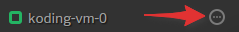
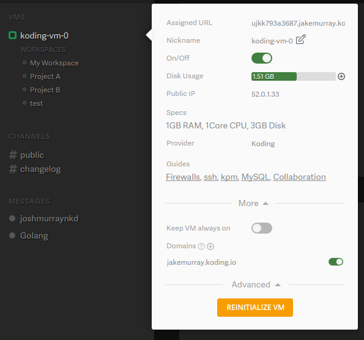

## Understanding the VM settings modal
This guide will explain the basics of the VM settings modal.

In order to open the VM settings modal you need to hover over the VM name on the right side of Koding (in the sidebar at the top) and then click on the three points icon that appears on the right of the VM label. (as seen in the image above)

After you click on the icon mentioned above the VM modal should open, which should look like the one pictured above. The VM settings are mostly self explanatory but we will outline them here for clarity. The VM settings modal has three main sections: the Basic section, the More section and the Advanced section.

### General Tab
The general tab houses the basic settings about your VM. These are:
1. On/Off: This toggle will switch your VM's state between on/off. We recommend using this to turn off your VM as compared to doing a `sudo poweroff` on your VM.
2. Keep VM always on: A paid feature, this allows you to keep your VM running all the time.
3. Nickname: You can use this to give your VM a nice name that you can remember!
4. Public IP: This is the public IP for your VM.
> type:tip
> For free accounts, the public IPs rotate every reboot.
5. Assigned URL: This is the system assigned URL/name for your VM. It's long so that it's never duplicated.

### Specs Tab
This tab shows you the basic specifications of your VM.

### Disk Usage Tab
Here you can see how much disk space you have used.

### Domains Tab
Here you can create a [custom/short URL for your VM](http://learn.koding.com/faq/vm-hostname/) and/or [define subdomains](http://learn.koding.com/faq/vm-hostname/) and [custom domains for your VM](http://learn.koding.com/guides/domains/). These come in handy if you are running multiple [virtual hosts](http://learn.koding.com/guides/vhosts-and-subdomains/) on your VM.

### VM Sharing
[Shared VMs](http://learn.koding.com/guides/permanent-shared-vm/), another feature for our paid accounts, allows you to share your VM with other Koding members even if you are not online.

### Advanced Tab
The advanced section includes settings that only advanced users should use. If you are an unexperienced user then this section should be off limits.
* Reinitialize VM: This button will set your VM back to its default state. This means that the VM will be re-imaged, as if you deleted the VM and created a new one. [This guide](https://learn.koding.com/faq/vm-reinit/) explains the reinit function in more detail.
* Terminate VM: You can remove your VM and create a new one if you so choose. We recommend you reinit your VM in lieu of deleting and recreating it.

If you encounter any issues or have any questions regarding the VM settings modal you can email us at [support@koding.com](mailto:support@koding.com) and we'll gladly help.
