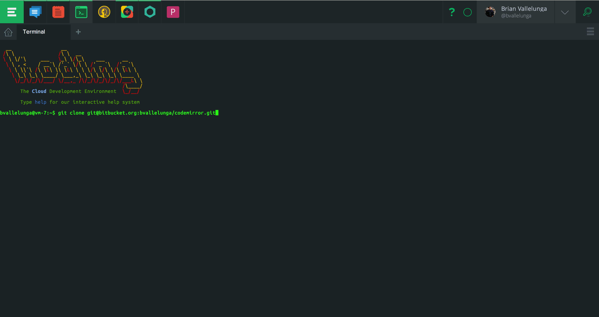
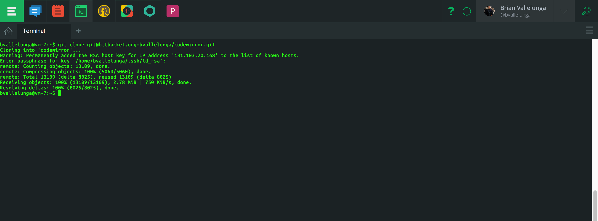
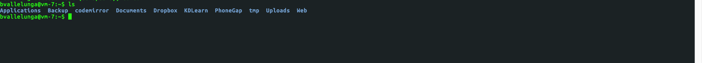

# Setup SSH for Git

If you already have ssh keys, then please skip this step.
Please follow this excellent guide by Atlassian on how to [setup
ssh keys](https://confluence.atlassian.com/display/BITBUCKET/Set+up+SSH+for+Git). 

# Selecting a Repository from Bitbucket

Now that you have setup ssh, it is time select a repository from Bitbucket.
When signing into Bitbucket you will be presented with a list of repositories.

For this guide I am going to choose the `codemirror` repository

# Getting the SSH Clone Url

In the repository dashboard you will see a panel in the upper right corner.
Set the url to `ssh` and copy the url.

# Clone the Repository

Good Job so far! Now lets clone the repository into your `~` folder

Once git is finished cloning, your terminal will look like this

# Verify the Repository Exists

The last step is to verify that the cloning proccess was successful.
To do this, get the directory listing and check to see if your intended folder exists.

As you can see, the `codemirror` folder exists. Thank you and have a wonderful Koding day!