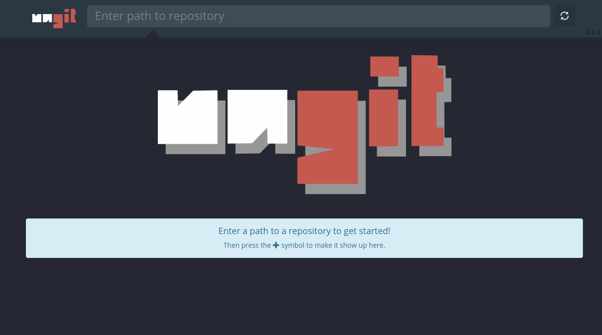
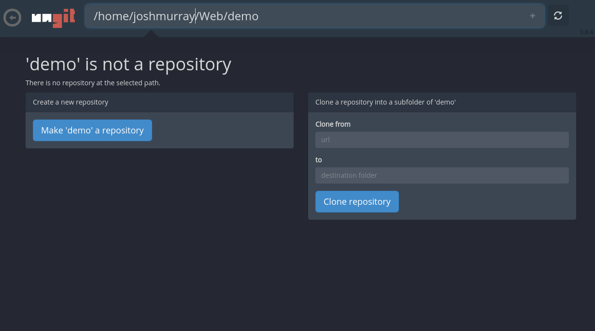
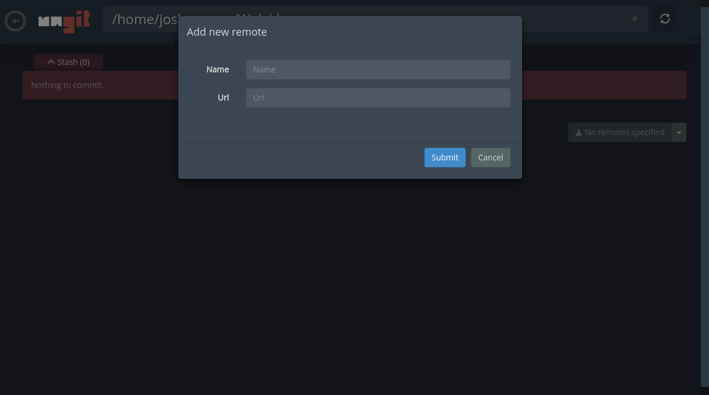
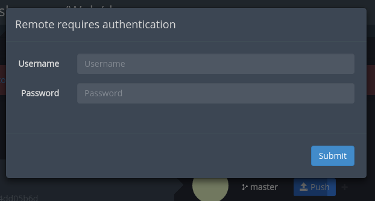
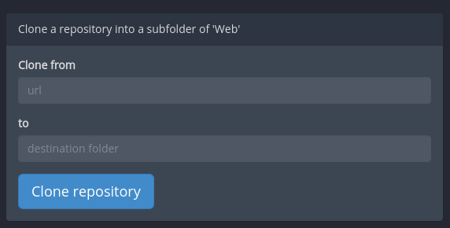

# Getting started with Git on Koding using Ungit

This guide will cover the basics on how to get started with Github on you Koding VM using Ungit.

## What is Ungit?

[Ungit](https://github.com/FredrikNoren/ungit) is a web based interface for Github made by [Fredrik Noren](https://github.com/FredrikNoren) that runs on any platform. It has a clean and intuitive UI that makes it easy to understand git. It runs on any platform that node.js & git supports and it works well with GitHub.

## Getting started

Before we begin please make sure you have the Koding Package Manager (KPM) installed on your VM. Follow [this guide](http://learn.koding.com/kpm) to understand what KPM is and how to install it so you will be able to continue with this guide.

## Setup

> type:tip
> `git` is installed by default with every Koding VM. So you will be able to get started right away.

Before you can get started with Github on your Koding VM you need to first setup the environment to be able to work properly with Github.

You'll need to generate an SSH key that will be used to authenticate with Github. You can use the following command to generate one:

```
ssh-keygen -t rsa -C "your_email@example.com"
```

After that you'll need to copy your Public Key, usually found in ~/.ssh/id_rsa.pub, and copy it in its entirety. Note the .pub in the filename. This is the public key, and it is very important that you copy this one. It will look something like this.

```
ssh-rsa AAAAB3NzaC1yc2EAAAADAQABAAABAQCyhKankDE4DRM86JqZ3JPdWDeqg+Tbzlql
TLfOKTeokhRoMgy5WoMY/ZWUVES3d2vSHHwW3cwWlELmVdc3Ow57boZv3fOsPhybYHVRTClX
Yr1ncSxyTvjvCfvV5q22aIxHPWQ353543ssda87sa+85XEa4VnveJsEzxBZl4oJ4GB0AGa48
+UdIqutrgZu7D7JCK+Yl228X+3bJf3ddlqDaKaVXPivvvYqImK6ZwFsxh2lNO4E8IOd3OSK9
zv6i+io8PxWmwP0tLFokxulAI8Td1sOPBE9s9bdJ5c2T/GfGjKF+aNKsd33TsYEjjc/plMZm
RRrOgQwre6OAkgMvyV2X your_email@example.com
```

Head over to this [page](https://github.com/settings/ssh) on Github and add the SSH key, that you just generated.

After that run the following command, in your Koding Terminal, to install the necessary dependency:

```
kpm install ungit
```

This will install a visually friendly interface for Github, where you will be able to interact with Github and your Koding VM. Think of it as a bridge between Koding and Github.

After the installation process has finished you will need to start the Github interface using the following command:

```
ungit
```

When the process has finished you should see a link outputted in the Terminal similar to this one:

```
your_koding_username.koding.io:8448
```

Copy that link and open it in a separate browser window. You should see something like this:



## Basic interaction

In the top area of the screen, in the input box you will be able to input the path to a local existing repository on your Koding VM or start with a fresh empty one.

> type:alert
> Please note that the input field has autocomplete

Start with a basic path like this one. Just make sure that folder exists before you input the path. If that folder doesn’t exist then you will be able to create it using this interface.

```
/home/your_koding_username/Web/demo
```

After that hit **Enter || Return**

You should see something like this:



Now, you can either transform that folder into a git repository or clone a repository in a subfolder in that folder.

Let’s transform this folder into a git repository. After transformation is complete just hit the little `+` sign at the top next to path, in order to see repository on the main view of the interface.

Before we continue, please make sure you have a Github repository ready in your Github account. Now you have to link that repository to your local Koding one using the Add new remote modal.



Copy the URL from your Github repository in this modal window and hit Submit.

Now head over to the Koding IDE and start adding code to your newly created repository. After you finished with your changes, you should already see you changes in the Ungit interface, just ready to be committed to your Github repository.

After you have named your commit, hit the commit button.

Now you can push your changes to the desired branch in your Github repository. Click on the name of the branch and then on the Push button.


You will be required to input your Github username and password before you can push your changes.



Input them, so you can continue with pushing your changes. After that you should see a successful commit of your changes.

Cloning an existing repository is a really straightforward process.

In order to clone a repository we need to have a location where we want to store our cloned repository.

Following the first step from above, in the input field at the top of Ungit select your desired path. For eg.

```
/home/your_koding_username/Web
```

Now you can clone any desired repository in this folder using this form:



Just copy the repository URL from Github, in the input field and then hit Clone repository.

Wait for the cloning process to finish and now you should see all the commit history and you are now able to work on that repository, perform commits, push changes, using the Koding IDE.

> type:alert
> Whenever you turn on Koding VM you will have to run the `ungit` command to get this interface started.

If you encounter any issues or have any questions please drop an email [here](mailto:support@koding.com).
