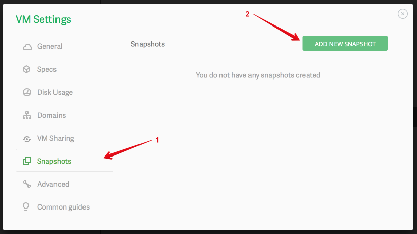
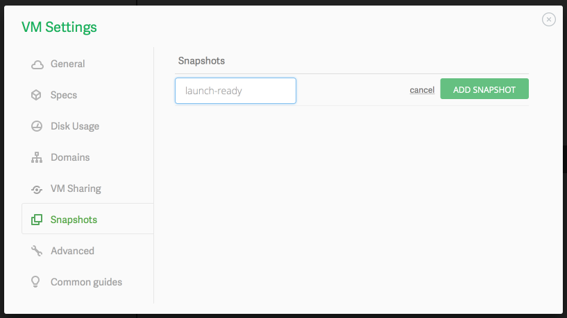
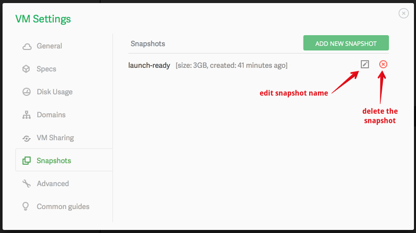
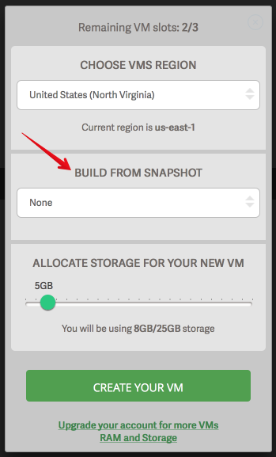

Koding's Snapshot feature gives you the ability to save a __point-in-time__ image of your virtual machine. When you make a snapshot,
the system will make a copy of the VM so that you can use it:
1. as a restorable backup
2. as a starting point for new VMs that you can create.

### How can I make a snapshot?
To create a snapshot, follow these easy steps:
1. Head over to [VM Settings](http://learn.koding.com/guides/understanding-vm-panel/) modal, click on 
the "Snapshots" tab as shown below and then click the "Add New Snapshot" button.

2. Give your new snapshot a name and then click on "Add Snapshot".

3. The snapshot will begin to build. 
> type:tip
> It can take anywhere between 2 to 5 minutes (depending on the size of your VM) to create the snapshot.

4. Once it is done creating, the snapshot will be listed and you can take additional actions on it (as shown
in the image below).

### How do I delete a snapshot?
To delete a snapshot, hover over the name of the snapshot with your mouse to reveal the snapshot
action button and from the available option, select the delete option.

### How many snapshots can I create?
The snapshot feature is only available to users with a paid plan. If you have a paid plan, the
snapshot limits are as follows:
1. Hobbyist plan: **1 snapshot**
2. Developer plan: **3 snapshots**
3. Professional plan: **5 snapshots**

> type:tip
> Free accounts cannot create snapshots (for now).

### How do I use a snapshot to create a new VM?
You can use a snapshot as the creation point for a new VM. This is helpful if you have done the work
to install the relevant software that you use and have a snapshot that is ready to be used.

To create a new VM using a snapshot, simply add a new VM (if your plan allows) and use an existing
snapshot as the starting point (as shown in the image below).

