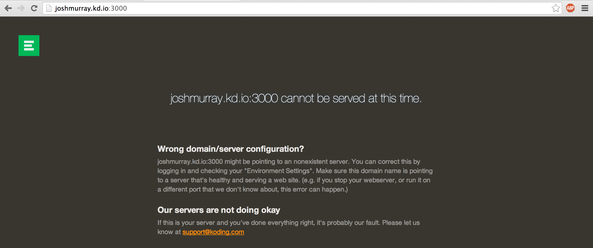
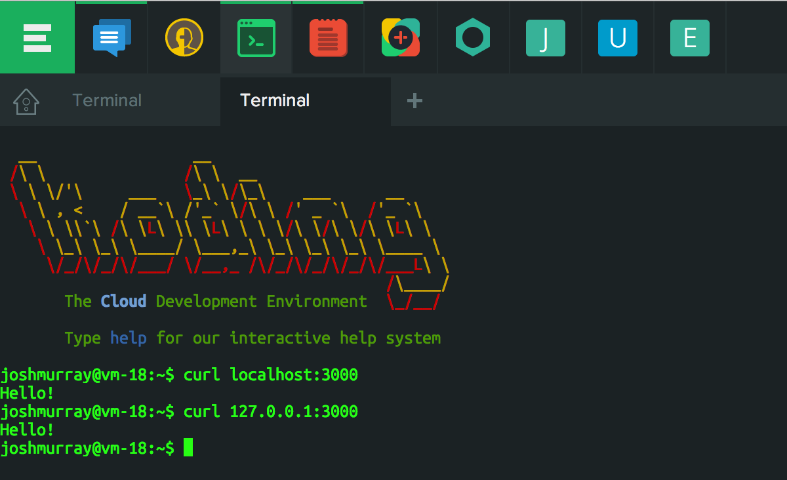
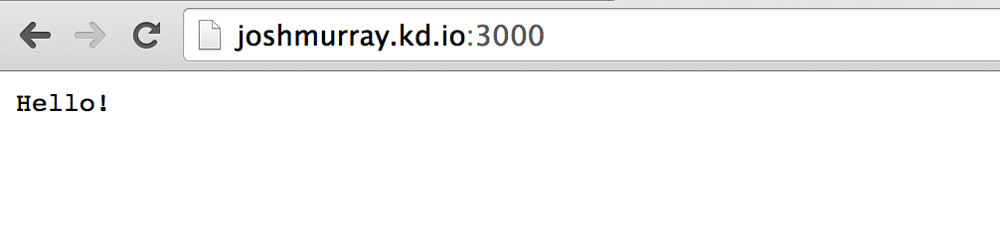

# What happened to 127.0.0.1?

Users who are new to Koding development are often confused about why they are 
not seeing their NodeJS, Python, Ruby or etc Apps on their Koding Domain. This 
guide will explain this common issue, and how to work around it.

## 0.0.0.0, your new 127.0.0.1

In short, use `0.0.0.0` for your Web Server IP instead of `127.0.0.1` on 
Koding. Lets dig a little deeper though, and explain what this means, and why.

## Why should i use 0.0.0.0?

When you run web server applications they need an IP and Port to listen on.
Many development applications will default the IP to `127.0.0.1`, the 
**machine's** localhost. This works fine on your Laptop, because you are 
accessing your web server *locally*. When you use a Koding VM, you typically 
access it from the Koding Domain, which means that you're accessing your web 
application *externally*. Meaning that connecting to `username.kd.io:3000` will 
*not* respond with a web server running on `127.0.0.1:3000`.

To solve this issue, we turn to out friendly `0.0.0.0` IP. Unlike `127.0.0.1`, 
this IP will accept connections from any source. Localhost, or external.

## An example

To help illustrate the above explanation, lets run a little NodeJS server and 
use `curl` and our browser to request it from multiple locations. If you want 
to follow along, copy the following code into a file named `hello.js`.

```javascript
require('http').createServer(function(req, res) {
  res.end('Hello!\n');
}).listen(3000, process.argv[2]);                                                                                                                               
console.log('Sending greetings on ', process.argv[2] + ':3000')
```

Now that we've creating our little Node server, lets open up our 
[Terminal][terminal] and run it with the following.

```
node hello.js 127.0.0.1
```

Next, lets visit out domain at the following address, making sure to replace 
`username` with your Koding username.

```
http://username.kd.io:3000
```

As you can see from the following two images, our web server is not responding 
on our domain but it **is** responding with `curl localhost`.





As we previous discussed, we need to bind our NodeJS server to the `0.0.0.0` 
address. Lets run our web server again with the proper address.

```shell
node hello.js 0.0.0.0
```

And open it up in our browser just like before.



Success!

Remember that the way in which you choose the IP of your Web Server can differ 
greatly between web frameworks. In this above example, we wrote our own web 
server, which accepts a single argument *(the bind ip)*.

Look at the documentation for your web framework of choice, as it will almost 
certainly be different than what was used in this example.


[terminal]: https://koding.com/Terminal
