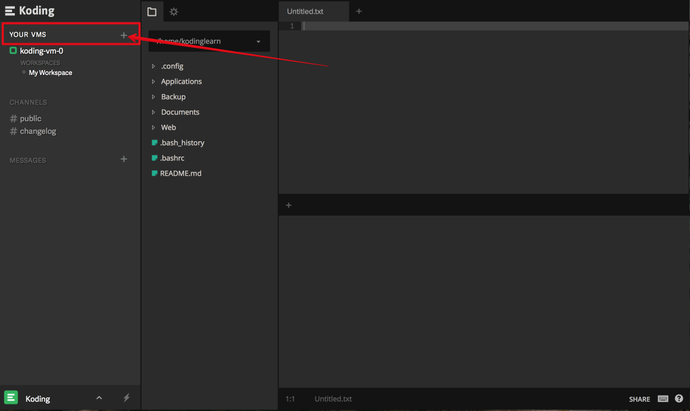

# What happens upon upgrade?

You just upgraded your account, awesome (and thanks!) but what happens now?

Based on the type of plan you selected on the [Pricing page][pricing] you now have access to more resources as compared to your free Koding account. These resources fall into the following categories:
- Ability to mark your VM(s) as Always-On
- Add more storage to your VM(s)
### Turn on "Always On" mode for your VM
1. Go to the [VM settings modal](http://learn.koding.com/guides/understanding-vm-panel/).
2. On the "General" tab, find the switch for "Always On" and turn it on. Your VM will
now not turn off even if you log out. This also means your public IP address will now be static.

### Adding more disk space
1. Head over to [VM settings](http://learn.koding.com/guides/understanding-vm-panel/)
2. Click on the "Disk Usage" tab and click the "resize your VM" link  (as shown in the image below)

3. This will open the resize modal from where you can resize your VM.

### Adding more VMs (Only for Developer and Professional Plans)
1. Hover your mouse over the "Your VMs" label in the sidebar (as shown in the image below)

2. The "+" icon will appear
3. Click the icon to and you will be presented with the option to create a new VM. You can select the size and the region of the VM.

[pricing]: https://koding.com/Pricing
