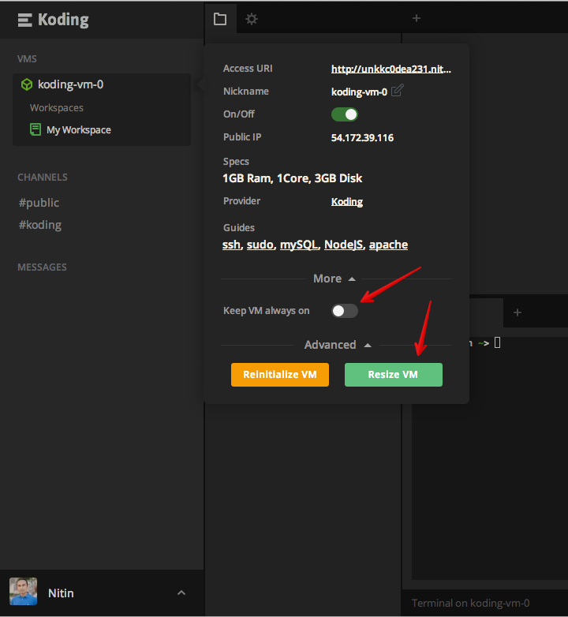
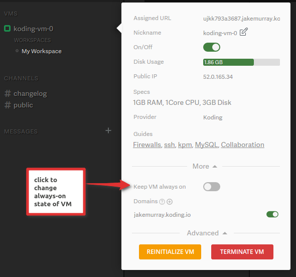
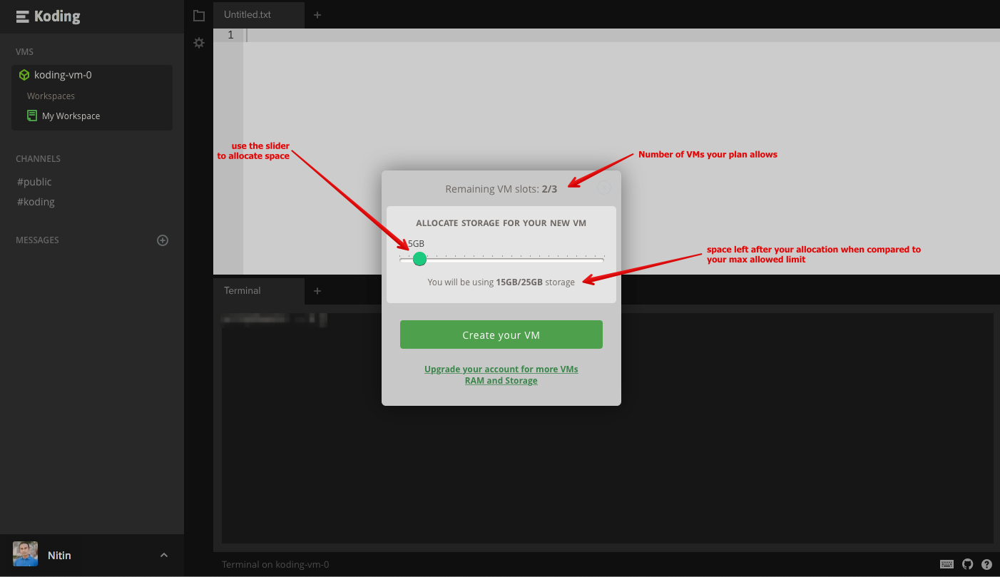

# What happens upon upgrade?

You just upgraded your account, awesome (and thanks!) but what happens now?

Based on the type of plan you selected on the [Pricing page][pricing] you now have access to more resources as compared to your free Koding account. These resources fall into the following categories:
- Ability to mark your VM(s) as Always-On
- Add more storage to your VM(s)

### Utilizing new resources when upgrading to the **Hobbyist Plan**
Once you have upgraded to Hobbyist, you can mark your VM as an Always-On VM and increase its storage from 3GB to 10GB. To to this, head over to the settings panel for your VM and follow these easy steps:
1. head over to VM settings (as shown in the image below)
2. expand the "More" panel and then the "Advanced" panel
3. You will see a new button under the Advanced panel labeled "Resize" (this button only appears for users who have upgraded to the Hobbyist plan and have not yet allocated the 10GB. Once you allocate it, the button will disappear)
4. Click the button to initiate resize. Once done, your VM will show 10GB. Verify that using the command `df -h /`

### Utilizing new resources when upgrading to the **Developer and Professional Plans**
Under these plans, you can have a total of up to 3 (for Developer) and 5 (for Professional) VMs, mark any of them as Always-On and allocate 25GB (for Developer) / 50GB (for Professional) of storage amonst them. You will start with the default free VM and it is up to you whether you want to leave it at the default 3GB or delete it so that you can make a new one with a storage allocation that you prefer. To delete a VM, simply go the settings panel of the VM and click the Terminate button (as shown in the attached screen shot).

To create a new VM, click the + icon in the VM list and you will be presented wit the option to create a new VM with a space allocation that is preferable to you (as shown below).

Enjoy the new resources and thanks again for upgrading! If you have any addtional questions regarding upgrades and resources, please send us a [support request](mailto:support@koding.com) and we will get back to you as soon as possible.

[pricing]: https://koding.com/Pricing
