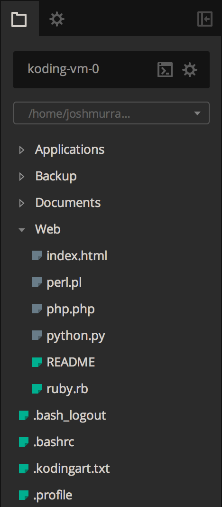
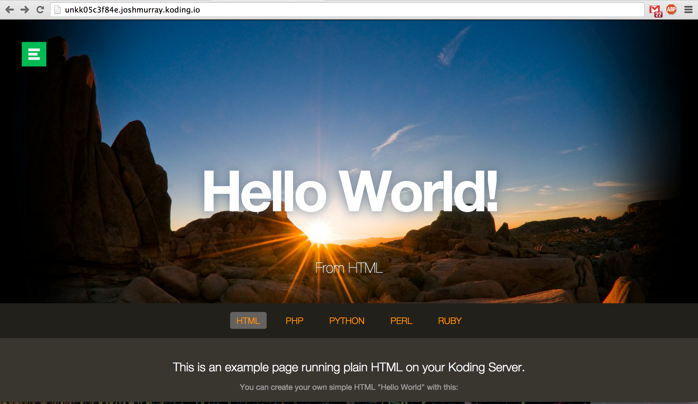

# Where is my Web Server Root?

Koding VMs come with Apache preconfigured and serve a sample site to get you 
started. The files for this site are found in what is typically called your 
*Web Server Root*. This is the directory that Apache is serving up files from, 
and it is located within your Home directory, under the `Web` directory. The 
full path being:

```
/home/username/Web
```

Replace `username` with your username.

You can modify the contents of this directory with the [Koding 
Terminal][terminal], or the [Ace Editor][ace]. In this example, we'll use Ace 
to browse the files with the FileTree.

First, open up [Ace][ace]. In the left hand side you'll see a FileTree, with a 
directory called `Web`. Double click the Web folder to expand it. Your FileTree 
should look something like this:



Those files are a series of example pages, and they're being served by Apache 
on your Koding Domain. You can view this site by visiting your Koding Domain, 
at:

```
http://username.kd.io
```

Where `username` is your Koding username. You should see something like this:



You'll notice that the PHP, Python, Perl, and Ruby links are actually files 
being generated from that language. As an example, the `python.py` file is 
being served up by Apache, with the aid of Apache's `mod_python` module. This 
serves to illustrate that this is a *real* Apache server, and you can use it 
just like you expect.

You should now understand where your Web Server Root is, and how to access it 
from the Web to develop and share your web applications. Happy Koding!


[koding]: https://koding.com
[ace]: https://koding.com/Ace
[terminal]: https://koding.com/Terminal
