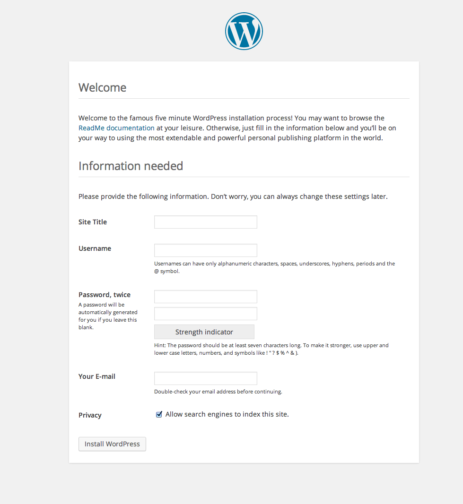
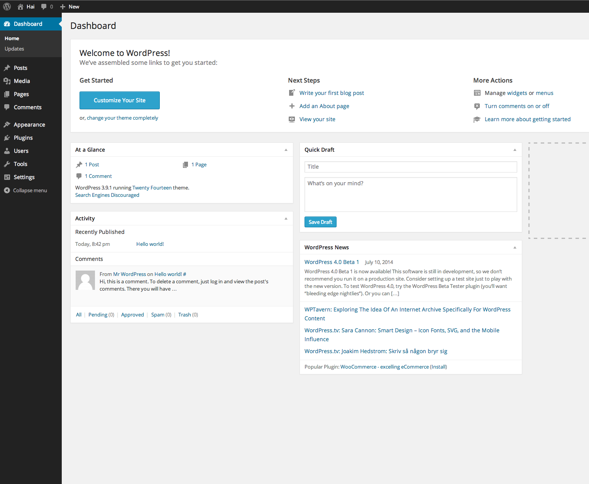
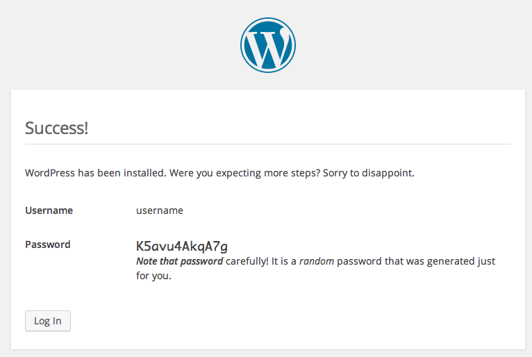
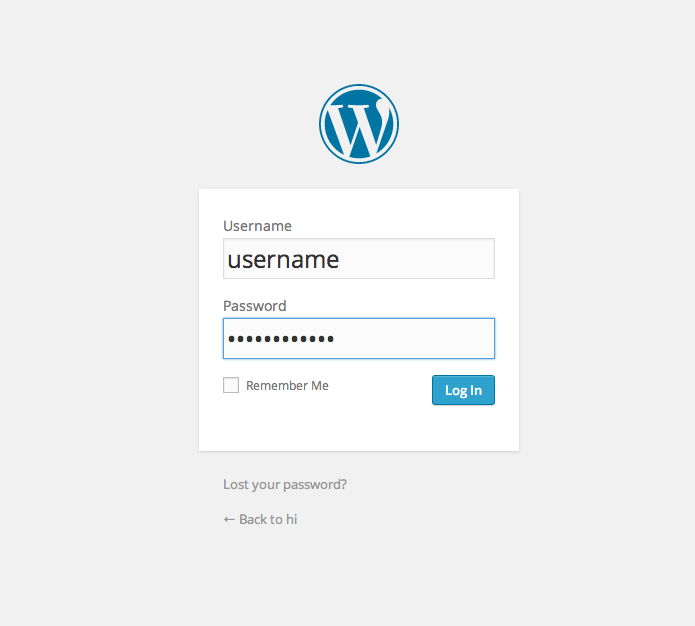
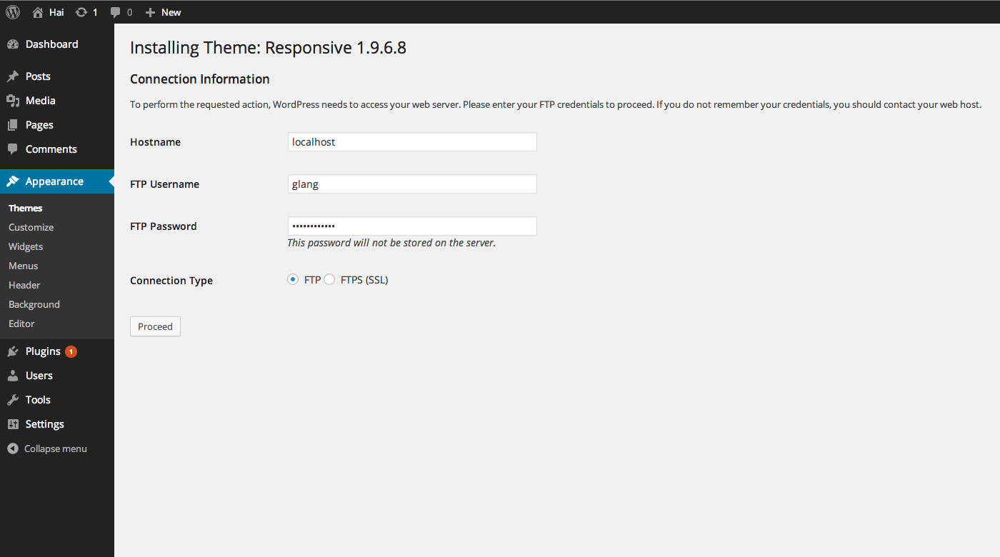
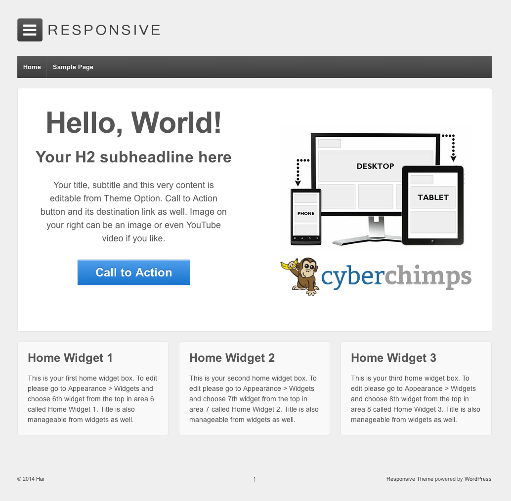

# DRAFT 3 Easy steps to set up WordPress on Koding

**What is WordPress?** 
WordPress is a free and open source blogging tool and a content management system (CMS) based on PHP and MySQL, which runs on a web hosting service. Features include a plug-in architecture and a template system. WordPress is used by more than 22% of the top 10 million websites as of August 2013. WordPress is the most popular blogging system in use on the Web, at more than 60 million websites.

Getting started with your own WordPress environment on Koding is as simple as following these 3 steps!

**Step 1: **
Run the [**WordPress Installer App**](https://koding.com/Wordpress) on [**Koding**](https://koding.com). [Note: you have to be 
logged into your [Koding account](https://koding.com/Login) in order to run the app.]


This is what you will see when you launch the app from the Koding App Store:



___

**Step 2: **
Once the setup is complete, a link to the page below will be presented. Click on the link and enter the information needed. Then click **Install WordPress** to complete your installation.



___

Congrats! WordPress is now installed!



___

After logging in, you will see your WordPress Dashboard, where you have full control over your WordPress environment:


___

**Step 3: **
Let's do some customization. Want to install a new theme? On the left menu bar, click **Appearance**, then **Add New Theme**. When prompted for connection information, enter this: 

```
Hostname: localhost
FTP Username: Your Koding Username
FTP Password: Your Koding Password
```




___

And here is a preview of the freshly installed **Responsive** theme: 





___

That's it for the WordPress on Koding Guide! Have fun!